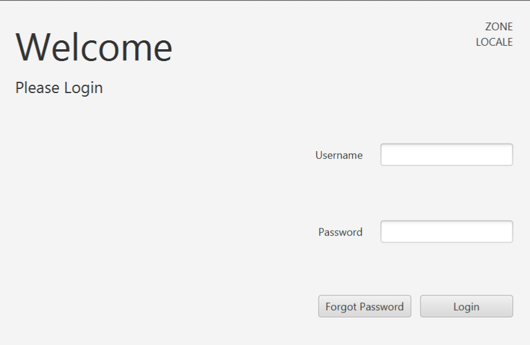
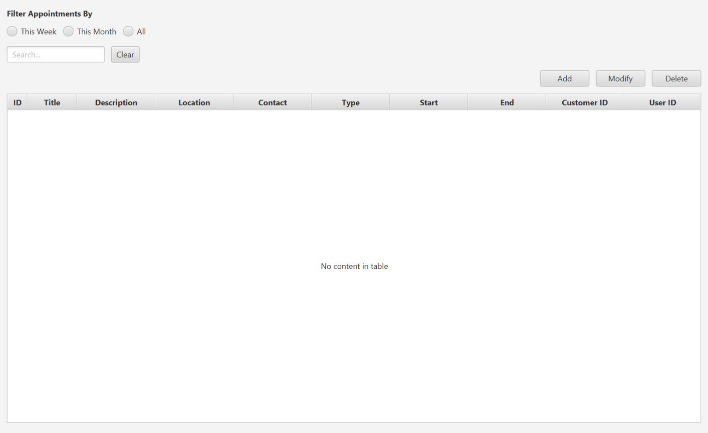
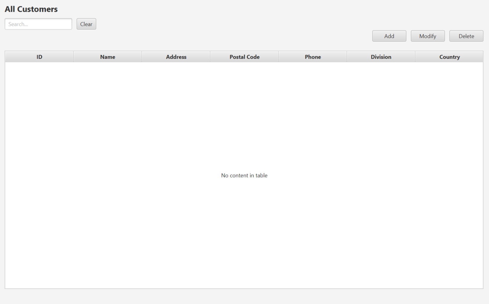

[![MIT License][license-shield]][license-url]
[![LinkedIn][linkedin-shield]][linkedin-url]

# Appointment App
An appointment and customer manager built with JavaFX

## About the Project
This desktop application was built for a Java course in my Software Development program. The program featuers basic appointment and customer managing features as well as several reports that can be run based on appointment data. Records are stored in a database accessed using JDBC. Localization is also available for French in addition to English. 

## User Interface
### Login

### Appointments Screen

### Customers Screen

## Running the Application
Clone the repository and use the command line or IDE such as IntelliJ to load the Maven project. Enter database information using static constants in src/database/DBConnection.java to connect to a database. Use Plugins -> javafx:run or mvn javafx:run from the command line to launch the application. 

[license-shield]: https://img.shields.io/github/license/othneildrew/Best-README-Template.svg?style=for-the-badge
[license-url]: https://github.com/othneildrew/Best-README-Template/blob/master/LICENSE.txt
[linkedin-shield]: https://img.shields.io/badge/-LinkedIn-black.svg?style=for-the-badge&logo=linkedin&colorB=555
[linkedin-url]: https://linkedin.com/in/samuel-s-jones
